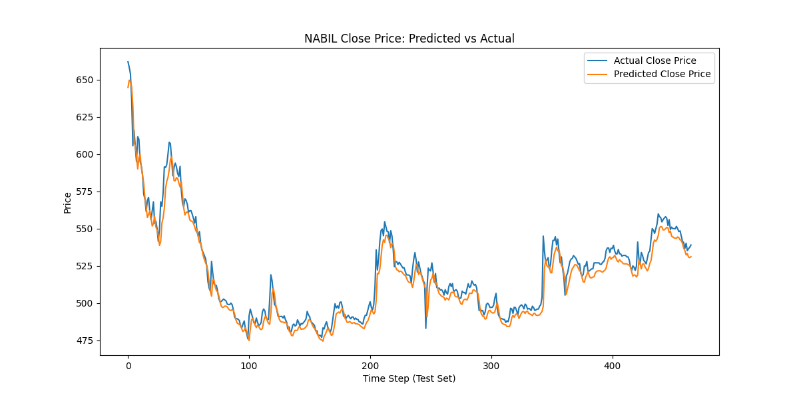
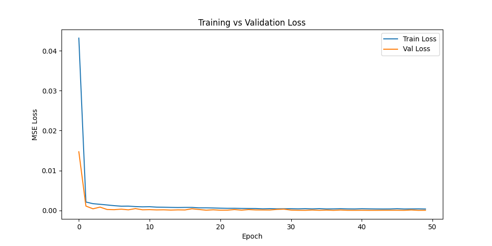

# NEPSE Stock Price Forecasting with PyTorch LSTM

A from-scratch PyTorch LSTM built to forecast next-day closing prices on the Nepal Stock Exchange (NEPSE), using NABIL Bank as the test case. This project's value isn't just the model — it's the evaluation process: comparing against a naive baseline and a return-based variant reveals real, well-documented limits of short-horizon stock forecasting.

## Data
- Source: [Aabishkar2/nepse-data](https://github.com/Aabishkar2/nepse-data) — daily OHLC, volume, and turnover for NEPSE-listed companies, auto-updated via GitHub Actions
- Symbol used: NABIL (Nabil Bank)
- Range: 2011-05-15 to 2026-09-03 (3,503 trading days)
- Split: chronological 70/15/15 (train/val/test) — no shuffling across time, to avoid leakage

## Approach

### Experiment 1 — Raw price LSTM
- Input: past 60 days of closing price → predict next day's close
- 2-layer LSTM (hidden size 64), manual training loop (no `.fit()` wrapper), MSE loss, Adam optimizer
- Custom PyTorch `Dataset`/`DataLoader` for sliding-window sequences

**Result:**
| Model | RMSE | MAE |
|---|---|---|
| LSTM | 7.73 | 5.70 |
| Naive (today's close = tomorrow's prediction) | 5.87 | 3.70 |

The naive baseline outperformed the LSTM. The predicted-vs-actual plot shows the model's predictions closely "shadow" the actual price with a slight lag — it largely learned to echo the previous value rather than genuinely predict movement, and that mimicry added noise rather than a real edge.




### Experiment 2 — Return-based LSTM
To force the model off the "just echo yesterday" strategy, the target was changed to next-day percent return instead of raw price.

**Result:**
- Train loss dropped steadily (0.90 → 0.62) while validation loss rose (0.38 → 0.47) — clear overfitting, since returns carry far less exploitable day-to-day signal than raw price.
- Directional accuracy (predicting up vs. down): **49.14%** — statistically a coin flip.

## Key finding

Neither model beat its baseline. This is a well-known and expected outcome in short-horizon financial forecasting: daily returns are close to a random walk, so there's very little exploitable signal for a model trained only on price history to find. The raw-price model's apparent "accuracy" was mostly an artifact of predicting a slow-moving series; once forced to predict returns directly, that illusion disappeared.

## What I'd try next
- Predict multi-day trends or classification (e.g., "will price rise >2% in 5 days") rather than exact next-day price
- Add engineered features: technical indicators (RSI, moving averages), volume-based signals, or sector/market-index context
- Backtest a simple trading strategy based on model output, rather than evaluating on price error alone
- Try attention-based or transformer architectures, which may capture longer-range dependencies raw LSTMs miss

## Stack
Python, PyTorch, pandas, NumPy, scikit-learn, matplotlib

## Repo structure
```
data/           # raw/processed data (gitignored)
notebooks/      # exploration and experiments
src/            # dataset, model, training modules
outputs/        # saved model weights and plots
```